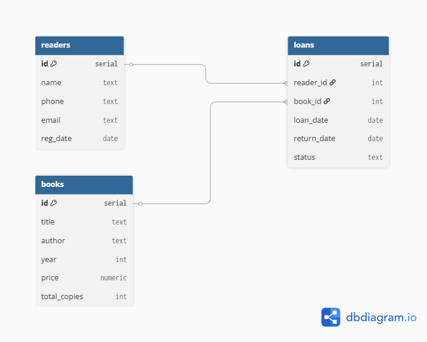

# ABC-анализ читателей библиотеки

## Описание
Проект содержит базу данных для библиотеки: читатели, книги, выдачи.  
Проведён **ABC-анализ** читателей по количеству выданных книг (правило Парето 80/20).

## ER-диаграмма

## Файлы
- `schema.sql` – создание таблиц (PostgreSQL).
- `data.sql` – тестовые данные (10 читателей, 10 книг, 41 выдача).
- `analysis.sql` – запрос ABC-анализа (категории A, B, C).

## Результат анализа

| Читатель           | Количество выдач | Накопленный % | Категория |
|--------------------|------------------|---------------|-----------|
| Дмитрий Соколов    | 11               | 26.83         | A         |
| Иван Петров        | 9                | 48.78         | A         |
| Анна Морозова      | 5                | 60.98         | A         |
| Ольга Михайлова    | 4                | 80.49         | B         |
| Мария Смирнова     | 4                | 80.49         | B         |
| Алексей Кузнецов   | 3                | 87.80         | B         |
| Елена Васильева    | 2                | 97.56         | C         |
| Павел Фёдоров      | 2                | 97.56         | C         |
| Сергей Воробьёв    | 1                | 100.00        | C         |
| Татьяна Лебедева   | 0                | 100.00        | C         |

### Вывод
- **Категория A** (30% читателей) дают ~61% всех выдач – самые активные.
- **Категория B** (30% читателей) дают ~27% выдач – средняя активность.
- **Категория C** (40% читателей) дают ~12% выдач – низкая активность.

**Рекомендация:** Поощрять категорию A (скидки, продлённый срок), стимулировать категорию B (акции «приведи друга»), для категории C проводить рекламные кампании.

## Как запустить (PostgreSQL)
1. Создайте БД `library_db`.
2. Выполните `schema.sql`.
3. Выполните `data.sql`.
4. Выполните `analysis.sql`.

## Автор
[Усманова Н]
